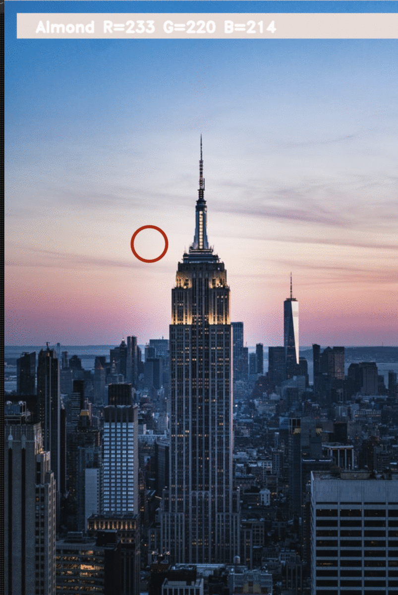

# ColorDetectionProject

This is a Python command line project made with [Python](https://www.python.org), [OpenCV](https://opencv.org), and [Pandas](https://pandas.pydata.org).

## Getting started

1. Install [python 3](https://www.python.org)
2. Install [dependencies](./requirements.txt)

- `pip3 install -r requirements.txt`

3. Run project

- `python3 main.py -i <PATH_TO_IMAGE>`
- example:
  - `python3 main.py -i example.png`

## How to use

1. Click anywhere on the image. This will return the name of the closest color and the RGB values.
2. Press escape to exit the program.

## How it works?

The program listens for a click, and then calculates the shortest distance of the selected pixel from the provided color list in `colors.csv`. It returns the closest match and displays the same in a rectangle at the top of the image. We keep track of a `minimum` variable, which is initially intialized to `max_distance` possible from a color. This `minimum` variable will be used to calculate the least difference between the currently calculated colour and all the colors in the `colors.csv` file. For more info, see [here](https://www.geeksforgeeks.org/python-pandas-extracting-rows-using-loc/)

